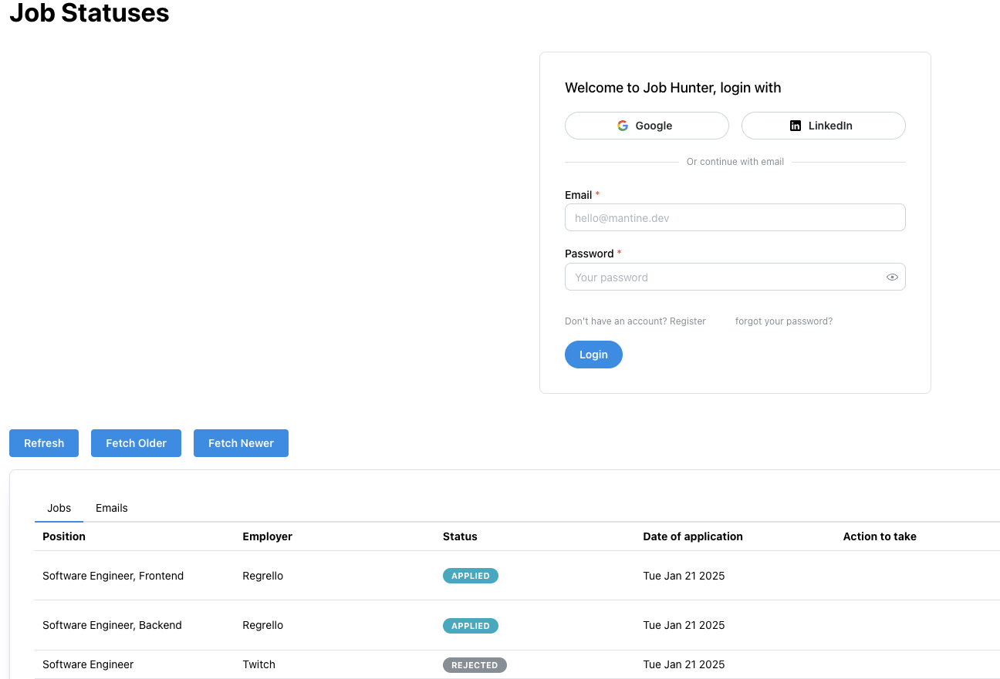

# Job Hunter

Job Hunter is a web application that helps you track your job applications and manage your communications.  It uses Firebase for authentication and database storage, and leverages the Gmail API to fetch email data.  The user interface is built with React and Mantine.



## Features

*   **Job Application Tracking:**  Track the status of your job applications, including employer, position, application date, interview dates, and actions to take.
*   **Email Integration:**  Integrates with Gmail to fetch relevant emails related to your job applications.
*   **User Authentication:** Secure user authentication using Firebase Authentication with options to sign in with Google, LinkedIn, and Email/Password.
*   **Responsive Design:** The application adapts to various screen sizes for optimal usability on desktops and mobile devices.
*   **Data Management:** Efficiently manages and displays job application and email data.


## Technologies Used

*   **Frontend:** React, Mantine UI, Firebase 
*   **Backend:** Node.js (Express.js), TypeScript, Firebase Admin SDK, Google APIs (Gmail API, Google People API)
*   **Database:** Firestore


## Installation

1.  **Clone the Repository:**

    ```bash
    git clone https://github.com/maboelsoud/job-hunter
    ```

2.  **Navigate to the Project Directory:**

    ```bash
    cd job-hunter
    ```

3.  **Install Dependencies for the parent repo and the client and server repos:**

    ```bash
    npm ci
    cd server && npm ci
    cd client && npm ci
    ```

4.  **Set up Environment Variables:**  Create a `.env` file (add `.env` to your `.gitignore`) in the root of your project containing the following.  These can be obtained from the firebase and Google Cloud Console.  **Never check sensitive data like this into version control.**

# Server-side config (in server/.env)
GOOGLE_CLIENT_ID=<your-google-client-id>
GOOGLE_CLIENT_SECRET=<your-google-client-secret>
GOOGLE_REDIRECT_URI=<your-google-redirect-uri>
REDIS_URL=<your-redis-url>  //If using Redis for sessions.  Likely needed.
SESSION_SECRET=<your-session-secret>  //Strong random string for sessions.  Needed if using sessions.
FIREBASE_CREDENTIALS=<your-firebase-credentials-json-string> //Firebase credentials.  Do not commit this to your repo.
FIREBASE_DATABASE_URL=<your-firebase-database-url> //Your Firestore database url.

5.  Start the Development Server:
```bash
npm run start
```
This will start both the frontend and backend development servers concurrently.

Usage
Sign In: Sign in using Google, LinkedIn, or your email address and password.
View Job Statuses: The application displays your job applications with filters.
View Emails: Use the tabs to switch between job statuses and emails.

## Contributing
Contributions are welcome! Please open an issue or submit a pull request.

License
Copyright (c) 2024-2025 Mohamed Abo El Soud.

Job Hunter is made available under the terms the MIT License.

See the [LICENSE-MIT](https://github.com/maboelsoud/job-hunter/blob/main/LICENSE) file for license details.